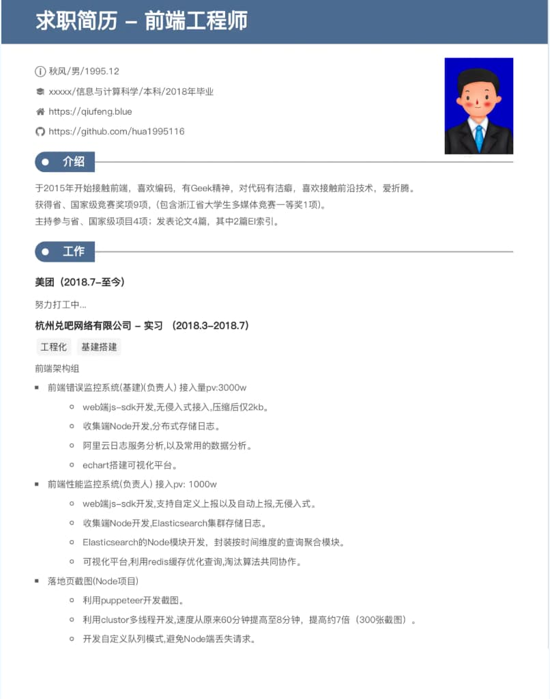
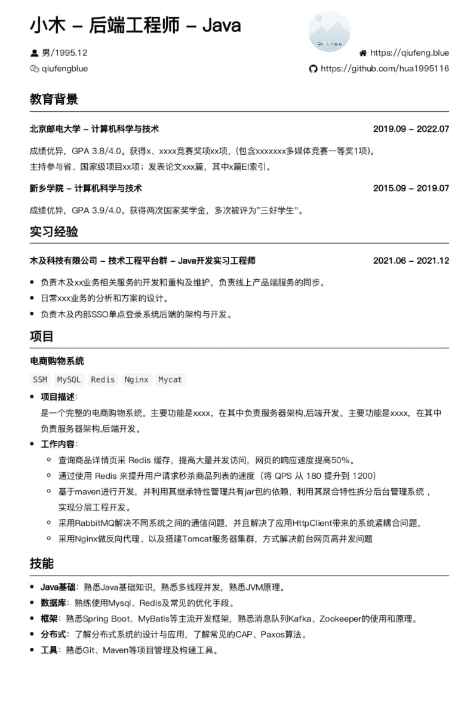
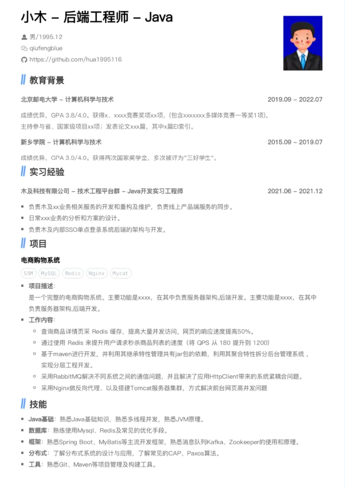

# 简历准备

> 简历注意点

- 1~2 页即可,不要带任何`精通`等字眼
- 项目经验真实详细且最好可展示
- 有突出开源项目一定附上`Github`,博客也可
- 学历、工作经验等经历一定要真实
- 优势重点突出,劣势回避不写
- 用 PDF 格式且加密,保护信息和隐私

## 前端标准简历

:::info 以 秋风大佬(美团在职前端) 为例

:::

## 后端标准简历

:::info 以 XX 大佬(XX 在职后端) 为例
后端我不熟哈 😥
:::

